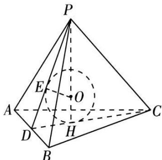

# 方法 1: 等体积法

以三棱雉 P-ABC 为例，求其内切球 OE 的半径
推导过程: 等体积法, 三棱雉 P-ABC 体积等于内切球球心与四个面构成的四个三棱雉的体积之和.
第一步: 先求出四个表面的面积和整个雉体体积;
第二步: 设内切球的半径为 r，球心为 O，建立等式：

$$
V _ {P - A B C} = V _ {O - A B C} + V _ {O - P A B} + V _ {O - P A C} + V _ {O - P B C}
$$

$\Rightarrow V_{P - ABC} = \frac{1}{3} S_{\triangle ABC} \cdot r + \frac{1}{3} S_{\triangle PAB} \cdot r + \frac{1}{3} S_{\triangle PAC} \cdot r + \frac{1}{3} S_{\triangle PBC} \cdot r = \frac{1}{3}\left(S_{\triangle ABC} + S_{\triangle PAB} + S_{\triangle PAC} + S_{\triangle PBC}\right) \cdot r$ 第三步：解出 $r = \frac{3V_{P - ABC}}{S_{O - ABC} + S_{O - PAB} + S_{O - PAC} + S_{O - PBC}} = \frac{3V}{S_{表}}.$ 公式： $r = \frac{3V}{S_{表}}$

![[高中/课堂同步/题库/高中数学全练一本通/立体几何初步/第十三节 专题-几何体的外接球与内切球问题/题型 2_ 求结合体的内接球/方法 1_ 等体积法/questions/Q00006284.md]]
![[高中/课堂同步/题库/高中数学全练一本通/立体几何初步/第十三节 专题-几何体的外接球与内切球问题/题型 2_ 求结合体的内接球/方法 1_ 等体积法/questions/Q00006285.md]]
![[高中/课堂同步/题库/高中数学全练一本通/立体几何初步/第十三节 专题-几何体的外接球与内切球问题/题型 2_ 求结合体的内接球/方法 1_ 等体积法/questions/Q00006286.md]]
![[高中/课堂同步/题库/高中数学全练一本通/立体几何初步/第十三节 专题-几何体的外接球与内切球问题/题型 2_ 求结合体的内接球/方法 1_ 等体积法/questions/Q00006287.md]]
