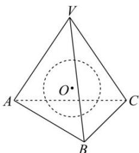

<!-- question-source:start -->
【56】(2024·全国高三专题)如图,三棱锥 V-ABC 中, $\angle AVB = \angle BVC = \angle CVA = 60^{\circ}$ , VA = VB = VC, 若三棱锥 V-ABC 的内切球 O 的表面积为 $6\pi$ , 则此三棱锥的体积为（）

A. $6\sqrt{3}$ B. $18\sqrt{3}$ C. $6\sqrt{2}$ D. $18\sqrt{2}$
<!-- question-source:end -->

![[Q00006292A1]]
