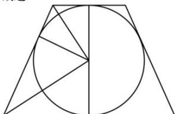

> [!faq]- 全练一本通解析
> **【答案】** D
>
> **【解析】**
> 解析: 圆台的轴截面为等腰梯形, 上底面半径为 $\sqrt{2}$ , 下底面半径为 $2\sqrt{2}$ , 则腰长为 $3\sqrt{2}$ ,
> 故梯形的高为 $\sqrt{\left(3\sqrt{2}\right)^{2}-\left(\sqrt{2}\right)^{2}}=4$ 则该圆台的体积为 $\frac{1}{3}\times4\pi\times\left[\left(\sqrt{2}\right)^{2}+\left(2\sqrt{2}\right)^{2}+\sqrt{2\times8}\right]=\frac{56\pi}{3}$ .
> 故选:D.
> 
