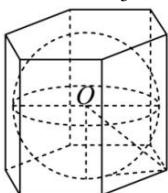
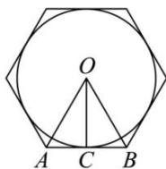

> [!faq]- 全练一本通解析
> **【答案】** $\frac{28\sqrt{7}}{3}\pi$
>
> **【解析】**
> 如图,在过球心 O 与棱柱棱垂直的截面 $\odot O$ 中,内切球的半径为 OC, $\triangle OAB$ 为边长是 2 的正三角形,
> 则 $OC = \sqrt{3}$ ，即内切球的半径为 $\sqrt{3}$ ，所以正六棱柱的高为 $2\sqrt{3}$ .
> 其外接球半径为 $\sqrt{(\sqrt{3})^{2}+2^{2}}=\sqrt{7}$ 则其体积为 $V=\frac{4}{3}\pi\times(\sqrt{7})^{3}=\frac{28\sqrt{7}}{3}\pi$ 故答案为： $\frac{28\sqrt{7}}{3}\pi$
> 
> 
