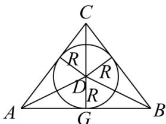

> [!faq]- 全练一本通解析
> **【答案】** B
>
> **【解析】**
> 解析: 圆锥的轴截面如图所示, 设内切球的球心为 D, 半径为 R,
> 则 AB=2, CG=2 , 所以 $AC=BC=\sqrt{\left(\frac{AB}{2}\right)^{2}+CG^{2}}=\sqrt{5}$ ,
> 又 $S_{\triangle ABC}=S_{\triangle ADB}+S_{\triangle ADC}+S_{\triangle BDC}$ 即 $\frac{1}{2}\times2\times2=\frac{1}{2}\times2R+\frac{1}{2}\times\sqrt{5}R+\frac{1}{2}\times\sqrt{5}R$ 解得 $R=\frac{2}{1+\sqrt{5}}=\frac{\sqrt{5}-1}{2}$ ，即内切球的半径为 $\frac{\sqrt{5}-1}{2}$ .
> 故选：B
> 
