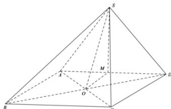

> [!faq]- 全练一本通解析
> **【答案】** D
>
> **【解析】**
> 解析：连接 AC,BD 交于点 O，取 AD 中点为 M，连接 SM,OS，作图如下：
> 
> 因为 $AS = DS, \angle ASD = 90^{\circ}$ , 又 $M$ 为 $AD$ 的中点, 故 $M$ 为 $Rt\triangle SAD$ 的外心,
> 又平面 $SAD \perp$ 平面 $ABCD$ , 且面 $SAD \cap$ 面 $ABCD = AD$ , 又 $OM \perp AD, OM \subset$ 面 $ABCD$ ,
> 故可得 $OM \perp$ 面 $SAD$ , 故 $OA = OS = OD$ ;
> 又四边形 $ABCD$ 为正方形, 且 $O$ 为对角线交点, 故可得 $OA = OB = OC = OD$ ,
> 综上所述, $OA = OB = OC = OD = OS$ , 故 $O$ 为四棱锥 $S - ABCD$ 的外接球的球心.
> 则其外接球半径 $R = OD = \frac{1}{2} BD = \sqrt{2}$ .
> 又 $P$ 为该四棱锥外接球表面上的动点, 若使得三棱锥 $P - SAD$ 的体积最大,
> 则此时点 $P$ 到平面 $SAD$ 的距离 $h = OM + R = 1 + \sqrt{2}$ ,
> 故其体积的最大值 $V = \frac{1}{3} S_{\triangle SAD} \times h = \frac{1}{3} \times \frac{1}{2} \times AD \times SM \times (1 + \sqrt{2})$ $= \frac{1}{3} \times \frac{1}{2} \times 2 \times 1 \times (1 + \sqrt{2}) = \frac{1 + \sqrt{2}}{3}$ .
>
> 故选 **D**.
