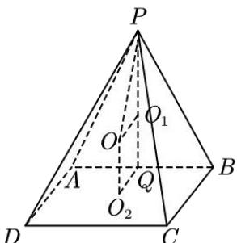

> [!faq]- 全练一本通解析
> **【答案】** $\frac{\sqrt{21}}{3}$
>
> **【解析】**
> 
> 如图, 过点 P 作 $PQ \perp AB$ 于 Q, 平面 $PAB \perp$ 平面 ABCD, 平面 $PAB \cap$ 平面 ABCD = AB, $\therefore PQ \perp$ 平面 ABCD, $V_{P-ABCD} = \frac{1}{3} \cdot PQ \cdot S_{ABCD}$ , 故四棱锥 P - ABCD 的体积最大, 即 PQ 最大, $\because AB = 2$ , PQ 最大, 即 $\triangle PAB$ 面积最大, 由 $\angle APB = 60^{\circ}$ , $S_{\triangle PAB} = \frac{1}{2} \cdot PA \cdot PB \cdot \sin \angle APB = \frac{\sqrt{3}}{4} \cdot PA \cdot PB$ , 得 $\cos \angle APB = \frac{AP^{2} + BP^{2} - 4}{2AP \cdot BP} = \frac{1}{2}$ , $AP^{2} + BP^{2} = AP \cdot BP + 4 \geq 2AP \cdot BP$ , 得 $AP \cdot BP \leq 4$ , 当且仅当 AP = BP = 2 时取等号, 此时 $\triangle PAB$ 面积最大, $\triangle PAB$ 为等边三角形. 取 $\triangle PAB$ 的外心为 $O_{1}$ , 正方形 ABCD 的外心为 $O_{2}$ ，过 $O_{1}, O_{2}$ 分别作所在平面的垂线，交点为 $O$ ， $O$ 即为四棱锥 $P - ABCD$ 外接球的球心，四边形 $OO_{2}QO_{1}$ 为矩形， $OO_{1} = O_{2}Q = 1$ ， $PO_{1} = \frac{2}{3} PQ = \frac{2\sqrt{3}}{3}$ ，设外接球半径为 $R$ ，则 $R = \sqrt{1^2 + \left(\frac{2\sqrt{3}}{3}\right)^2} = \frac{\sqrt{21}}{3}$ . 故答案为： $\frac{\sqrt{21}}{3}$ .
