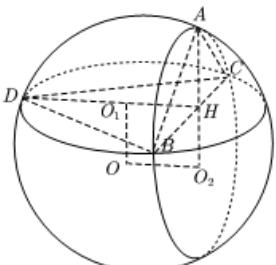

> [!faq]- 全练一本通解析
> **【答案】** $\frac{\sqrt{3}}{3}$ ； $\frac{20\pi}{3}$
>
> **【解析】**
> - **①**：因为 $\angle BAC = 120^\circ$ 所以 $S_{\triangle ABC} = \frac{1}{2} AB \cdot AC \sin \angle BAC = \frac{\sqrt{3}}{4} AB \cdot AC$ 又 $BC^2 = AB^2 + AC^2 - 2AB \cdot AC \cdot \cos 120^\circ$ 即 $4 = AB^2 + AC^2 + AB \cdot AC \geq 2AB \cdot AC + AB \cdot AC = 3AB \cdot AC$ 所以 $AB \cdot AC \leq \frac{4}{3}$ 所以 $S_{\triangle ABC} = \frac{\sqrt{3}}{4} AB \cdot AC \leq \frac{\sqrt{3}}{4} \times \frac{4}{3} = \frac{\sqrt{3}}{3}$ 即 $\triangle ABC$ 面积的最大值为 $\frac{\sqrt{3}}{3}$ ②过 $A$ 作 $AH \perp BC$ ，垂足为 $H$ ， $S_{\triangle ABC} = \frac{1}{2} AH \cdot BC = AH$ 则 $\triangle ABC$ 面积的最大时， $AH$ 最大， $AH$ 的最大值为 $\frac{\sqrt{3}}{3}$ ，此时 $\triangle ABC$ 为等腰三角形， $H$ 为 $BC$ 中点 $S_{\triangle BCD} = \frac{1}{2} \times 2 \times 2 \times \frac{\sqrt{3}}{2} = \sqrt{3}$ ， $V_{A-BCD} = \frac{1}{3} S_{\triangle BCD} \cdot h = \frac{\sqrt{3}}{3} h$ 则当 $AH \perp$ 平面 $BCD$ 时， $h$ 最大，此时面 $ABC \perp$ 面 $BCD$ 如图，
> 
> 设 O 为四面体 ABCD 外接球的球心， $O_{1}$ ， $O_{2}$ 分别为 $\triangle ABC$ ， $\triangle BCD$ 的外接圆的圆心. $OO_{1}\perp$ 平面 ABC， $OO_{2}\perp$ 平面 BCD，
> 在 $\triangle ABC$ 中 $\frac{BC}{\sin\angle BAC}=\frac{4\sqrt{3}}{3}=2O_{2}A\Rightarrow O_{2}A=\frac{\sqrt{3}}{3}$ $DO_{1}=\frac{2}{3}DH=\frac{2}{3}\times\frac{\sqrt{3}}{2}\times2=\frac{2\sqrt{3}}{3}$ $OO_{1}=O_{2}H=O_{2}A-AH=\frac{\sqrt{3}}{3}$ ∴ 四面体 ABCD 外接球的半径 $R=\sqrt{OO_{1}^{2}+O_{1}D^{2}}=\sqrt{\frac{5}{3}}$ 外接球的表面积为 $4\pi R^{2}=\frac{20\pi}{3}$
