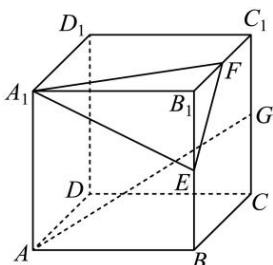

<!-- question-source:start -->
【2】如图, 在正方体 $ABCD-A_{1}B_{1}C_{1}D_{1}$ 中, 点 E, F 分别是棱 $B_{1}B$ , $B_{1}C_{1}$ 的中点, 点 G 是棱 $C_{1}C$ 的中点, 作出过线段 AG 且平行于平面 $A_{1}EF$ 的截面图形. 并说明作法及理由.

<!-- question-source:end -->

![[Q00006214A1]]
