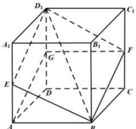

> [!faq]- 全练一本通解析
> **【答案】** 作图见解析
>
> **【解析】**
> 在正方形 $CDD_{1}C_{1}$ 中, 过 F 作 FG//DC, 且交棱 $DD_{1}$ 于点 G,
> $$
> A G
> $$
> $$
> A D D _ {1} A _ {1}
> $$
> $$
> D _ {1}
> $$
> $$
> D _ {1} E / / A G
> $$
> $$
> E
> $$
> $$
> E B, E D _ {1}
> $$
> $$
> B E D _ {1} F
> $$
> $$
> \alpha
> $$
> 
> 理由:由题意,平面 $\alpha\cap$ 平面 $AD_{1}=D_{1}E$
> $\alpha\cap$ 平面 $BC_{1}=BF$ ，平面 $AD_{1}//$ 平面 $BC_{1}$
> 应有 $D_{1}E//BF$
> 同理， $BE//FD_{1}$ ，所以四边形 $BED_{1}F$ 应是平行四边形，
> 由作图过程， $FG \parallel DC$ ，FG = DC，又 $AB \parallel DC$ ，AB = DC
> $$
> A B \mathbin {/ /} F G
> $$
> $$
> A B = F G
> $$
> $$
> A B F G
> $$
> $$
> A G / / B F, A G = B F
> $$
> 由作图过程, $D_{1}E//AG$ . 又 $EA//D_{1}G$ ,
> 所以四边形 $EAGD_{1}$ 是平行四边形，所以 $D_{1}E // AG$ ， $D_{1}E = AG$
> 又 $AG//BF$ ， $AG = BF$ ，所以 $D_{1}E//BF$ ，且 $D_{1}E = BF$ ，
> 所以 $BED_{1}F$ 是平行四边形, 四边形 $BED_{1}F$ 就是要作的截面.
