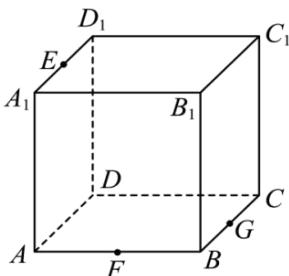

<!-- question-source:start -->
【6】正方体 $ABCD - A_{1}B_{1}C_{1}D_{1}$ 中, E 是棱 $A_{1}D_{1}$ 中点, F 是棱 AB 中点, G 是棱 BC 中点, 作出过 E, F, G 的平面截得正方体的截面形状, 并保留作图痕迹.

第十二节 专题: 立体几何的截面问题
<!-- question-source:end -->

![[Q00006218A1]]
