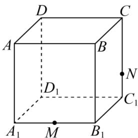

<!-- question-source:start -->
【7】如图, 正方体 $ABCD - A_{1}B_{1}C_{1}D_{1}$ , M 是 $A_{1}B_{1}$ 的中点, 点 N 在棱 $CC_{1}$ 上, 且 $CN = 2NC_{1}$ . 作出过点 D, M, N 的平面截正方体 $ABCD - A_{1}B_{1}C_{1}D_{1}$ 所得的截面, 并保留作图痕迹.

<!-- question-source:end -->

![[Q00006219A1]]
