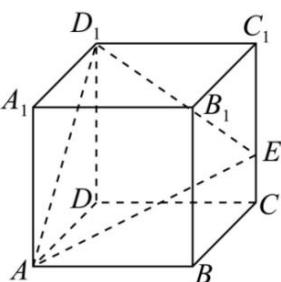

<!-- question-source:start -->
【8】如图, 在正方体 $ABCD-A_{1}B_{1}C_{1}D_{1}$ 中, E 是棱 $CC_{1}$ 上一点, 且 $CE:EC_{1}=1:2$ , 试画出过 $D_{1}, A, E$ 三点的平面截正方体 $ABCD-A_{1}B_{1}C_{1}D_{1}$ 所得的截面, 并保留作图痕迹.

<!-- question-source:end -->

![[Q00006220A1]]
