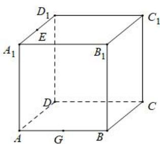

<!-- question-source:start -->
【9】在正方体 $ABCD-A_{1}B_{1}C_{1}D_{1}$ 中, 现要作一个截面去截这个正方体, 且过 E, G, $C_{1}$ 三点, 其中 E, G 分别是 $A_{1}D_{1}$ , AB 的中点, 请在图上作出截面, 并保留作图痕迹.

<!-- question-source:end -->

![[Q00006221A1]]
