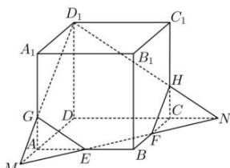
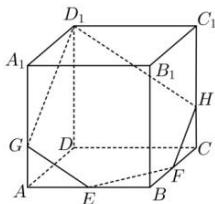

> [!faq]- 全练一本通解析
> **【答案】** 作图见解析
>
> **【解析】**
> 在正方体 $ABCD-A_{1}B_{1}C_{1}D_{1}$ 中, 画直线 EF 与 DA, DC 的延长线分别交于点 M, N,
> 连接 $D_{1}M, D_{1}N$ ，分别与棱 $AA_{1}, CC_{1}$ 交于点 $G, H$ ，连接 $EG, FH$ ，如图1，抹去 $MA, ME, MG$ 和 $NC, NF, NH$ 得过 $D_{1}, E, F$ 三点的正方体
> $ABCD-A_{1}B_{1}C_{1}D_{1}$ 的截面五边形 $D_{1}GEFH$ ，如图 2.
> 
> 
> 图1
> 图2
