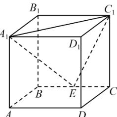

<!-- question-source:start -->
【15】（2024·全国模拟预测）如图，在棱长为2的正方体 $ABCD - A_{1}B_{1}C_{1}D_{1}$ 中， $E$ 为棱 $BC$ 的中点，用过点 $A_{1},E,C_{1}$ 的平面截正方体，则截面周长为（）

A. $3\sqrt{2} + 2\sqrt{5}$ B.9 C. $2\sqrt{2} + 2\sqrt{5}$ D. $3\sqrt{2} + 2\sqrt{3}$
<!-- question-source:end -->

![[Q00006227A1]]
