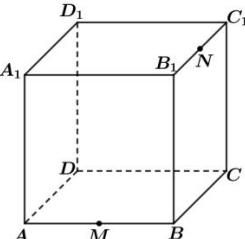

<!-- question-source:start -->
【19】(2021·山西三模)如图,在棱长为4的正方体 $ABCD-A_{1}B_{1}C_{1}D_{1}$ ，中，M，N分别为棱AB， $B_{1}C_{1}$ 的中点，过C，M，N三点作正方体的截面，则以B点为顶点，以该截面为底面的棱锥的体积为（）

A. $\frac{8}{3}$ B. 8 C. $\frac{8\sqrt{3}}{3}$ D. $\frac{16\sqrt{3}}{3}$
<!-- question-source:end -->

![[Q00006231A1]]
