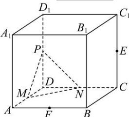

<!-- question-source:start -->
【20】(2024·全国高三专题练习)如图所示,在正方 $ABCD-A_{1}B_{1}C_{1}D_{1}$ 中,AB=2,E,F,P,M,N分别是 $AB,CC_{1},DD_{1},AD,CD$ 的中点,存在过点E,F的平面 $\alpha$ 与平面PMN平行,平面 $\alpha$ 截该正方体得到的截面面积为\_\_\_\_.

<!-- question-source:end -->

![[Q00006232A1]]
