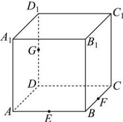

<!-- question-source:start -->
【22】（2024·广东高二上期末）如图, 在棱长为 6 的正方体 $ABCD-A_{1}B_{1}C_{1}D_{1}$ 中, E, F, G 分别是棱 AB, BC, $DD_{1}$ 中点, 过 E, F, G 三点的平面与正方体各个面所得交线围成的平面图形的周长为 \_\_\_\_.

<!-- question-source:end -->

![[Q00006234A1]]
