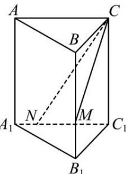

<!-- question-source:start -->
【24】（2023·黑龙江高一）正三棱柱 $ABC-A_{1}B_{1}C_{1}$ 中，AB=4， $AA_{1}=3$ ， $A_{1}C_{1}=4A_{1}N$ ， $BB_{1}=3MB_{1}$ ，平面 CMN 截三棱柱所得截面的周长是（）

A. $3\sqrt{2} + 4\sqrt{5}$ B. $3\sqrt{2} + 3\sqrt{5} + \sqrt{3}$ C. $4\sqrt{2} + 3\sqrt{5}$ D. $3\sqrt{2} + 4\sqrt{5} + \sqrt{3}$
<!-- question-source:end -->

![[Q00006236A1]]
