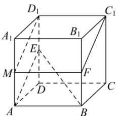

> [!faq]- 全练一本通解析
> **【答案】** A
>
> **【解析】**
> 解析: 取 $AA_{1}$ 的中点 M，连接 $D_{1}M$ ，MF， $C_{1}F$ ，
> 
> ∵ 正方体 $ABCD-A_{1}B_{1}C_{1}D_{1}$ ，∴ $D_{1}C_{1} \perp$ 平面 $ADD_{1}A_{1}$ ，∵ $D_{1}M \subset$ 平面 $ADD_{1}A_{1}$ ，∴ $D_{1}C_{1} \perp D_{1}M$ ，
> ∵ F 是 $BB_{1}$ 的中点，∴ $D_{1}C_{1} //MF //AB$ ，且 $D_{1}C_{1} = AB = MF$ ，
> ∴ 四边形 $D_{1}C_{1}FM$ 是矩形，
> ∵ MA // $D_{1}E$ 且 MA = $D_{1}E$ ，∴ 四边形 $AMD_{1}E$ 是平行四边形，∴ $D_{1}M //EA$ ，
> ∵ MF ∉ 平面 ABE，AB ⊂ 平面 ABE，∴ MF // 平面 ABE，
> ∵ $D_{1}M \not\subset$ 平面 ABE，EA ⊂ 平面 ABE，∴ $D_{1}M //$ 平面 ABE，
> ∵ $D_{1}M \cap MF = M$ ， $D_{1}M \subset$ 平面 $D_{1}C_{1}FM$ ，MF ⊂ 平面 $D_{1}C_{1}FM$ ，
> ∴ 平面 $D_{1}C_{1}FM //$ 平面 ABE，即平面 $D_{1}C_{1}FM$ 为过点 F 且平行于平面 ABE 的平面截正方体所得平面，
> ∵ AB = 2，∴ MF = 2， $D_{1}M = \sqrt{5}$ ∴ $S_{D_{1}C_{1}FM}=2\times\sqrt{5}=2\sqrt{5}$ .
>
> 故选 **A**.
