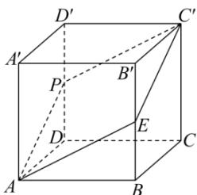

> [!faq]- 全练一本通解析
> **【答案】** A
>
> **【解析】**
> 解析:取 DD' 中点 P, 连接 AP, PC',
> 由正方体的性质可知 AP//EC', AP=EC', 可得四边形 APC'E 为平行四边形,
> 又 AP = AE = $\sqrt{5}$ , 则四边形 APC'E 为为菱形.
> 所以截面为边长为 $\sqrt{5}$ 的菱形，两对角线长分别为 $2\sqrt{2}, 2\sqrt{3}$ 所以该截面的面积为 $S=\frac{2\sqrt{2}\times2\sqrt{3}}{2}=2\sqrt{6}$
> 
>
> 故选 **A**.
