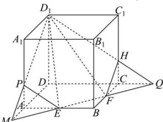

> [!faq]- 全练一本通解析
> **【答案】** C
>
> **【解析】**
> 解析:延长 DA, DC，与直线 EF 相交于 M, Q，
> 连接 $D_{1}M, D_{1}Q$ 与 $A_{1}A, C_{1}C$ 分别交于点 P, H，连接 PE, HF，
> 则五边形 $D_{1}PEFH$ 即为截面 $\Omega$ ，
> 正方体的棱长为2，点E,F分别是AB,BC的中点，
> 所以 $EF=\frac{1}{2}\times\sqrt{2^{2}+2^{2}}=\sqrt{2}$ 由 Rt△BEF ≅ Rt△CQF ≅ Rt△AEM 得， $AM=CQ=BE=BF=1, EF=ME=FQ=\sqrt{2}$ 所以 P, H 分别为靠近 A, C 的三等分点，故 $A_{1}P=C_{1}H=\frac{4}{3}$ 所以由勾股定理得 $D_{1}P=D_{1}H=\sqrt{2^{2}+\left(\frac{4}{3}\right)^{2}}=\sqrt{4+\frac{16}{9}}=\sqrt{\frac{52}{9}}=\frac{2\sqrt{13}}{3}$ $PE=FH=\sqrt{1^{2}+\left(\frac{2}{3}\right)^{2}}=\sqrt{1+\frac{4}{9}}=\sqrt{\frac{13}{9}}=\frac{\sqrt{13}}{3}$ $D_{1}H=\sqrt{2^{2}+\left(\frac{2}{3}\right)^{2}}=\sqrt{1+\frac{4}{9}}=\sqrt{\frac{13}{9}}=\frac{\sqrt{13}}{3}$ 所以 $\Omega$ 的周长为 $D_{1}P + PE + EF + FH + D_{1}H = \frac{2\sqrt{13}}{3} \times 2 + \frac{\sqrt{13}}{3} \times 2 + \sqrt{2} = 3\sqrt{13} + \sqrt{2}$
> 
>
> 故选 **C**.
