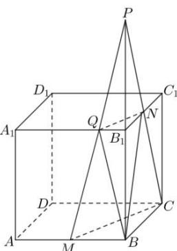

> [!faq]- 全练一本通解析
> **【答案】** B
>
> **【解析】**
> 
> 解析：A
> 延长 $BB_{1},CN$ 交于点 $P$ ，连接 $PM$ 交 $A,B_{1}$ 于 $M$ ，则平面CMQN为所求截面，故 $V_{B - QMCN} = V_{P - MBC} - V_{B - PQN} = V_{P - MBC} - V_{Q - PBN}$ $= \frac{1}{3}\times \frac{1}{2}\times 2\times 4\times 8 - \frac{1}{3}\times \frac{1}{2}\times 2\times 8\times 1 = 8$ ，
>
> 故选 **B**.
