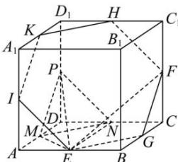

> [!faq]- 全练一本通解析
> **【答案】** C
>
> **【解析】**
> $3\sqrt{3}$
> 解析: 分别取 $C_{1}D_{1}, A_{1}D_{1}, AA_{1}$ 的中点 H, K, I，连接 HF, HK, KI, EI，可证平面 EGFHKI // 平面 PMN，则存在过点 E, F 的平面 $\alpha$ 与平面 PMN 平行，正六边形 EGFHKT 是平面 $\alpha$ 截该正方体得到的截面，截面的面积是 $6 \times \frac{\sqrt{3}}{4} \times (\sqrt{2})^{2} = 3\sqrt{3}$ ，故选：C.
> 
