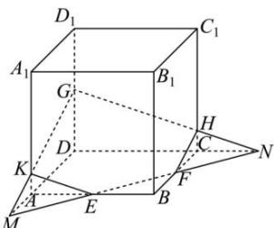

> [!faq]- 全练一本通解析
> **【答案】** 详见解析
>
> **【解析】**
> 解析: 直线 EF 与直线 AD, CD 分别交于点 M, N, 连接 GM, GN 分别交 $AA_{1}, CC_{1}$ 于是 K, H, 连接 EK, FH,
> 则五边形 EFHGK 是过 E,F,G 三点的平面截正方体 $ABCD-A_{1}B_{1}C_{1}D_{1}$ 所得截面, 如图,
> 
> 显然 $AM = AE = CF = CN = 3$ ， $\frac{AK}{DG} = \frac{MK}{MG} = \frac{AM}{MD} = \frac{3}{3 + 6} = \frac{1}{3}$ 则 $AK = 1$ $FH = EK = \sqrt{1^2 + 3^2} = \sqrt{10}$ ， $GH = GK = \frac{2}{3} GM = \frac{2}{3}\sqrt{3^2 + 9^2} = 2\sqrt{10}$ 而 $EF = 3\sqrt{2}$ ，所以五边形EFHGGK的周长为 $6\sqrt{10} +3\sqrt{2}$
> $$
> 6 \sqrt {1 0} + 3 \sqrt {2}
> $$
