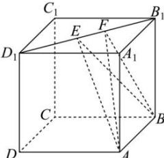

<!-- question-source:start -->
【3】如图, 正方体 $ABCD - A_{1}B_{1}C_{1}D_{1}$ 的棱长为 3, 线段 $B_{1}D_{1}$ 上有两个动点 E, F, 且 $EF = \sqrt{2}$ , 则三棱锥 A - BEF 的体积为（）

A. 1 B. 2 C. $\frac{3}{2}$ D. 4
<!-- question-source:end -->

![[Q00006131A1]]
