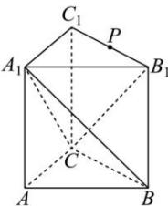

> [!faq]- 全练一本通解析
> **【答案】** $\frac{\sqrt{21}}{7}$
>
> **【解析】**
> 在正三棱柱 $ABC - A_{1}B_{1}C_{1}$ 中, 若 $AB = AA_{1} = 1$ , $B_{1}C_{1}//BC, BC \subset$ 平面 $A_{1}BC, B_{1}C_{1} \not\subset$ 平面 $A_{1}BC$ 所以 $B_{1}C_{1}//$ 平面 $A_{1}BC$ ，动点 P 在棱 $B_{1}C_{1}$ 上，
> 所以 P 到平面 $A_{1}BC$ 的距离等于 $B_{1}$ 到平面 $A_{1}BC$ 的距离，
> 由勾股定理可得 $A_{1}B = A_{1}C = \sqrt{1^{2} + 1^{2}} = \sqrt{2}$ 在等腰三角形 $A_{1}BC$ 中，底边 BC 上的高长为 $\sqrt{\left(\sqrt{2}\right)^{2}-\left(\frac{1}{2}\times1\right)^{2}}=\frac{\sqrt{7}}{2}$ 所以等腰三角形 $A_{1}BC$ 的面积为 $\frac{1}{2}\times1\times\frac{\sqrt{7}}{2}=\frac{\sqrt{7}}{4}$ 由正三棱锥性质可得， $S_{\triangle B_{1}BC}=\frac{1}{2}\times1\times1=\frac{1}{2}$ 且平面 $B_{1}BC \perp$ 平面 $A_{1}B_{1}C_{1}$ ，平面 $B_{1}BC \cap$ 平面 $A_{1}B_{1}C_{1}=B_{1}C_{1}$ 所以 $A_{1}$ 到平面 $B_{1}BC$ 的距离为 $A_{1}$ 到 $B_{1}C_{1}$ 的距离 $\frac{\sqrt{3}}{2}$ 设点 $B_{I}$ 到平面 $A_{1}BC$ 的距离为 h，
> $V_{B_1 - A_1BC} = V_{A_1 - BB_1C}\Rightarrow \frac{1}{3}\cdot h\cdot \frac{\sqrt{7}}{4} = \frac{1}{3}\times \frac{1}{2}\times \frac{\sqrt{3}}{2}\Rightarrow h = \frac{\sqrt{21}}{7},$ 故答案为： $\frac{\sqrt{21}}{7}$
> 
