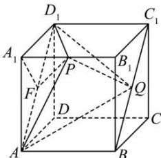

> [!faq]- 全练一本通解析
> **【答案】** D
>
> **【解析】**
> 解析: 因为 $ABCD - A_{1}B_{1}C_{1}D_{1}$ 为正方体, 所以 $C_{1}D_{1} // A_{1}B_{1}$
> 
> 因为 $C_{1}D_{1} \subset$ 平面 $ABC_{1}D_{1}$ ， $A_{1}B_{1} \not\subset$ 平面 $ABC_{1}D_{1}$ ，所以 $A_{1}B_{1} //$ 平面 $ABC_{1}D_{1}$ ，
> 所以点 P 到平面 $ABC_{1}D_{1}$ 的距离也即 $A_{1}B_{1}$ 到平面 $ABC_{1}D_{1}$ 的距离，也即点 P 到平面 $AQD_{1}$ 的距离不随 $A_{1}P = \lambda$ 的变化而变化，设点 P 到平面 $AQD_{1}$ 的距离为 h，过点 $A_{1}$ 作 $A_{1}F \perp AD_{1}$ ，根据正方体的特征可知： $AB \perp$ 平面 $ADD_{1}A_{1}$ ，因为 $A_{1}F \subset$ 平面 $ADD_{1}A_{1}$ ，所以 $AB \perp A_{1}F$ ， $AB \cap AD_{1} = A$ ，所以 $A_{1}F \perp$ 平面 $ABC_{1}D_{1}$ ，则有 $h = A_{1}F = \frac{\sqrt{2}}{2}$ ，
> 因为 $C_{1}D_{1} // AB$ 且 $C_{1}D_{1} = AB$ ，所以四边形 $ABC_{1}D_{1}$ 为平行四边形，所以 $BC_{1} // AD_{1}$ ，
> 所以点 Q 到 $AD_{1}$ 的距离也即 $BC_{1}$ 到 $AD_{1}$ 的距离，且距离为 1，所以 $S_{\triangle AD_{1}Q}= \frac{1}{2}\times AD_{1}\times1=\frac{\sqrt{2}}{2}$ （定值），
> 所以 $V_{D_{1}-APQ}=V_{P-D_{1}AQ}=\frac{1}{3}S_{\triangle AD_{1}Q}\cdot h=\frac{1}{3}\times\frac{\sqrt{2}}{2}\times\frac{\sqrt{2}}{2}=\frac{1}{6}$ （定值），
> 则三棱锥 $D_{1}-APQ$ 的体积不随 $\lambda$ 与 $\mu$ 的变化而变化，也即与与 $\lambda,\mu$ 都无关。
>
> 故选 **D**。
