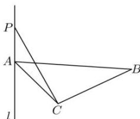

<!-- question-source:start -->
【7】如图, 在 $\triangle ABC$ 中, $\angle ACB=90^{\circ}$ , 直线 $l$ 过点 $A$ 且垂直于平面 $ABC$ , 动点 $P\in l$ , 当点 $P$ 逐渐远离点 $A$ 时, $\angle PCB$ 的度数（）

A.逐渐变大 B.逐渐变小 C.不变 D.先变大再变小
<!-- question-source:end -->

![[Q00006135A1]]
