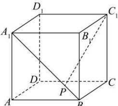

<!-- question-source:start -->
【11】如图, 在正方体 $ABCD - A_{1}B_{1}C_{1}D_{1}$ 中, P 为线段 $A_{1}B$ 上的动点, 则直线 $C_{1}P$ 与平面 $A_{1}B_{1}B$ 所成角的正弦值的取值范围是（）

A. $\left[\frac{\sqrt{2}}{2},\frac{\sqrt{6}}{3}\right]$ B. $\left[0,\frac{\sqrt{6}}{3}\right]$ C. $\left[0,\frac{\sqrt{2}}{2}\right]$ D. $\left[\frac{\sqrt{3}}{3},\frac{\sqrt{2}}{2}\right]$
<!-- question-source:end -->

![[Q00006139A1]]
