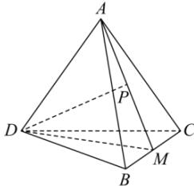

> [!faq]- 全练一本通解析
> **【答案】** A
>
> **【解析】**
> A解析：解：连接DM
> 
> ∵ 四面体 ABCD 是正四面体，M 是 BC 的中点，
> ∴△DBC、△ABC 是等边三角形，
> ∴ $BC \perp DM$ ， $BC \perp PM$ 。
> ∵ $DM \subset$ 平面 DMP， $PM \subset$ 平面 DMP， $DM \bigcap PM = M$ ，
> ∴ $BC \perp$ 平面 DMP，又 $DP \subset$ 平面 DMP，
> ∴ $BC \perp DP$ ∴ 直线 DP 与 BC 所成角为 $90^{\circ}$ .
>
> 故选 **A**.
