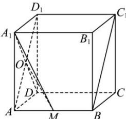

> [!faq]- 全练一本通解析
> **【答案】** C
>
> **【解析】**
> 解析: 解: 设 $AD_{1} \cap A_{1}D = O$ ，连接 OM，则 $AD_{1} \perp A_{1}D$ ，
> 因为在正方体 $ABCD-A_{1}B_{1}C_{1}D_{1}$ 中， $AB \perp$ 平面 $ADD_{1}A_{1}$ ， $A_{1}D \subset$ 平面 $ADD_{1}A_{1}$ ，
> 所以 $AB \perp AD_{1}$ ,
> 因为 $AD_{1} \cap AB = A$ , $AD_{1}, AB \subset$ 平面 $ABC_{1}D_{1}$ ,
> 所以 $A_{1}O \perp$ 平面 $ABC_{1}D_{1}$ ,
> 所以 $\angle A_{1}MO$ 即为 $A_{1}M$ 与平面 $ABC_{1}D_{1}$ 所成角 $\theta$ .
> 设 $AA_{1}=2,\tan\theta=\frac{A_{1}O}{OM}=\frac{\sqrt{2}}{OM}$ 因为 $\sqrt{2} \leq OM \leq \sqrt{6}$ 所以 $\tan\theta\in[\frac{\sqrt{3}}{3},1]$ 因为 $\theta\in\left[0,\frac{\pi}{2}\right]$ ，所以 $\theta\in\left[\frac{\pi}{6},\frac{\pi}{4}\right]$ ，故选:C.
> 
