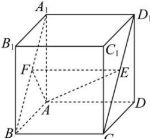

> [!faq]- 全练一本通解析
> **【答案】** D
>
> **【解析】**
> 解析:如图,
> 
> 在 $A_{1}B$ 上取点 $F$ ，使得 $A_{1}F = D_{1}E$ ，连接 $EF$ ，由 $BF = CE$ ， $BF // CE$ 可知四边形 $FBCE$ 为平行四边形，则 $EF = BC = 2$ ，因为 $BC \perp$ 平面 $AA_{1}B_{1}B$ ， $BC // EF$ ，所以 $EF \perp$ 平面 $AA_{1}B_{1}B$ ，所以 $AE$ 与平面 $AA_{1}B_{1}B$ 所成角为 $\angle EAF$ ， $\tan \angle EAF = \frac{EF}{AF} = \frac{2}{AF}$ ，而 $AF \in [\sqrt{2}, 2]$ .所以 $\tan \angle EAF \in [1, \sqrt{2}]$ .显然 $\sqrt{3} \notin [1, \sqrt{2}]$ ，故D不可能.
>
> 故选 **D**
