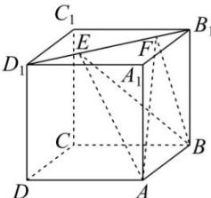

<!-- question-source:start -->
【13】（多选）如图, 正方体 $ABCD - A_{1}B_{1}C_{1}D_{1}$ 的棱长为 4, 线段 $B_{1}D_{1}$ 上有两个动点 E、F 且 EF = 1, 则下列结论中正确的是（）

第十节 专题:立体几何中的动点问题

A. $AC_{1} \perp EF$ B. $S_{\triangle AEF}: S_{\triangle BEF} = \sqrt{6}: 2$ C. $A_{1}C \perp$ 平面 $AEF$ D. 三棱锥 $V_{E - FAB}$ 为定值
<!-- question-source:end -->

![[Q00006141A1]]
