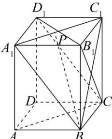

> [!faq]- 全练一本通解析
> **【答案】** D
>
> **【解析】**
> 解析:在长方体 $ABCD-A_{1}B_{1}C_{1}D_{1}$ 中,
> 
> $BB_{1} // DD_{1}$ ，当 P 是 $A_{1}C_{1}$ 与 $B_{1}D_{1}$ 的交点时， $BP \subset$ 平面 $BDD_{1}B_{1}$ ，BP 与 $DD_{1}$ 相交，A 不是；
> 当点 P 与 $C_{1}$ 重合时， $BP \subset$ 平面 $BCC_{1}B_{1}$ ，BP 与 $B_{1}C$ 相交，B 不是；
> 当点 P 与 $A_{1}$ 重合时，因为长方体 $ABCD - A_{1}B_{1}C_{1}D_{1}$ 的对角面 $A_{1}BCD_{1}$ 是矩形，此时 $BP // D_{1}C$ ，C 不是；
> 因为 AC ⊂ 平面 ABCD, $B \notin AC, B \in$ 平面 ABCD, 而 $P \notin$ 平面 ABCD, 因此 BP 与 AC 是异面直线, D 是.
>
> 故选 **D**
