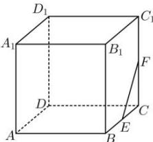

<!-- question-source:start -->
【17】如图, 在棱长为 1 的正方体 $ABCD - A_{1}B_{1}C_{1}D_{1}$ 中, 点 E, F 分别是棱 BC, $CC_{1}$ 的中点, P 是底面 ABCD（含边界）上一动点, 满足 $A_{1}P \perp EF$ , 则线段 $A_{1}P$ 长度的取值范围是 \_\_\_\_.

<!-- question-source:end -->

![[Q00006145A1]]
