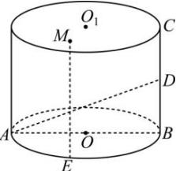

<!-- question-source:start -->
【21】如图, 在圆柱 $OO_{1}$ 中, AB 为底面直径, E 是 $\widehat{AB}$ 的中点, D 是母线 BC 的中点, M 是上底面上的动点, 若 AB = 4, BC = 3, 且 $ME \perp AD$ , 则点 M 的轨迹长度为（）

A. $\frac{3}{2}$ B. $\sqrt{7}$ C. $\frac{5\sqrt{7}}{4}$ D. 4
<!-- question-source:end -->

![[Q00006149A1]]
