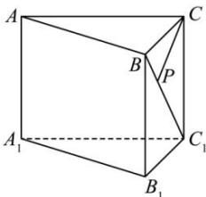

<!-- question-source:start -->
【24】如图,三棱柱 $ABC-A_{1}B_{1}C_{1}$ 中, $AA_{1}\perp$ 底面 ABC, $\angle ACB=90^{\circ}$ , $AC=6, BC=CC_{1}=\sqrt{2}, P$ 是 $BC_{1}$ 上一动点, 则 $CP+PA_{1}$ 的最小值是 \_\_\_\_.

<!-- question-source:end -->

![[Q00006152A1]]
