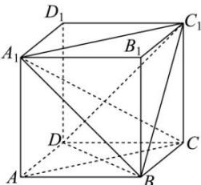

> [!faq]- 全练一本通解析
> **【答案】** B
>
> **【解析】**
> 解析: 在棱长为 1 的正方体 ABCD - A, B, C, D 中, 连接 DC, BD, AC.
> 
> 由 $AA_{1} \perp$ 平面 $ABCD, BD \subset$ 平面 $ABCD$ , 得 $BD \perp AA_{1}$ , 而 $BD \perp AC$ , $AA_{1} \cap AC = A, AA_{1}, AC \subset$ 平面 $AA_{1}C$ , 则 $BD \perp$ 平面 $AA_{1}C$ , 又 $A_{1}C \subset$ 平面 $AA_{1}C$ , 于是 $BD \perp A_{1}C$ , 同理 $BC_{1} \perp A_{1}C$ , 而 $BC_{1} \cap BD = B, BC_{1}, BD \subset$ 平面 $BC_{1}D$ , 因此 $A_{1}C \perp$ 平面 $BC_{1}D$ , 因为 $DP \perp A_{1}C$ , 则 $DP \subset$ 平面 $BC_{1}D$ ,
> 而点 $P$ 为截面 $A_{1}C_{1}B$ 上的动点，平面 $A_{1}C_{1}B \cap$ 平面 $BC_{1}D = BC_{1}$ ，所以点 $P$ 的轨迹是线段 $BC_{1}$ ，长度为 $\sqrt{2}$ 。
>
> 故选 **B**
