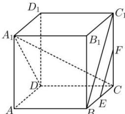

> [!faq]- 全练一本通解析
> **【答案】** $[\sqrt{2}, \sqrt{3}]$
>
> **【解析】**
> 连接 $BC_{1}$ ， $A_{1}D$ ，如图所求：
> 
> 可得 $EF / / BC_1$ ， $A_{1}D\bot BC_{1}$ ， $\therefore A_{1}D\bot EF$ 又 $DC\bot EF$ ，可得 $EF\bot$ 平面 $A_{1}DC$ ，则 $A_{1}C\bot EF$ ∴当 $P$ 在线段 $CD$ 上运动时，有 $A_{1}P\bot EF$ 当 $P$ 与 $D$ 重合时， $A_{1}P$ 有最小值为 $\sqrt{2}$ ，当 $P$ 与 $C$ 重合时， $A_{1}P$ 有最大值为 $\sqrt{3}$ ∴线段 $A_{1}P$ 长度的取值范围是 $[\sqrt{2},\sqrt{3} ]$ 故答案为： $[\sqrt{2},\sqrt{3} ]$
