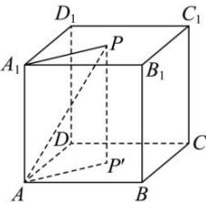
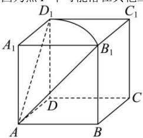

> [!faq]- 全练一本通解析
> **【答案】** D
>
> **【解析】**
> D解析：若点 $P$ 在正方形 $A_{1}B_{1}C_{1}D_{1}$ 内，过点 $P$ 作 $PP^{\prime}\bot$ 平面ABCD于 $P^{\prime}$ ，连接 $AP^{\prime},A_{1}P$ ：
> 
> 则 $\angle PAP'$ 为直线 $AP$ 与平面 $ABCD$ 所成的角，则 $\angle PAP' = \frac{\pi}{4}$ ，又 $PP' = 1$ ，则 $PA = \sqrt{2}$ ，得 $PA_{1} = 1$ ，则点 $P$ 的轨迹为以 $A_{1}$ 为圆心半径为 1 的圆（落在正方形内的部分），若点 $P$ 在正方形 $ABB_{1}A_{1}$ 内或 $ADD_{1}A_{1}$ 内，轨迹分别为线段 $AB_{1}$ 和 $AD_{1}$ ，因为点 $P$ 不可能落在其他三个正方形内，所以点 $P$ 的轨迹如图所示：
> 
> 故点 P 的轨迹长度为 $2\sqrt{1+1} + \frac{1}{4} \times 2\pi = 2\sqrt{2} + \frac{\pi}{2}$ .
>
> 故选 **D**
