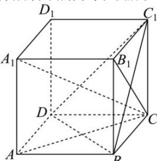

> [!faq]- 全练一本通解析
> **【答案】** D
>
> **【解析】**
> 解析:由题意可知,动点P的轨迹为过点B与直线 $A_{1}C$ 垂直的截面与正方体的表面的交线.如图所示:
> 
> 在正方体 $ABCD - A_1B_1C_1D_1$ 中， $BD \perp AC, BD \perp AA_1$ ，
> 又 $AC, AA_1 \subset$ 平面 $AA_1C$ 且 $AC \cap AA_1 = A$ ，所以 $BD \perp$ 平面 $AA_1C$ ，
> 因为 $A_1C \subset$ 平面 $AA_1C$ ，所以 $BD \perp A_1C$ 。
> 又在正方体 $ABCD - A_1B_1C_1D_1$ 中， $BC_1 \perp B_1C, BC_1 \perp B_1A_1$ ，
> 又 $B_1C, B_1A_1 \subset$ 平面 $B_1CA_1$ 且 $B_1C \cap B_1A_1 = B_1$ ，所以 $BC_1 \perp$ 平面 $B_1CA_1$ ，
> 因为 $A_1C \subset$ 平面 $B_1CA_1$ ，所以 $BC_1 \perp A_1C$ 。
> 又因为 $BD \perp A_1C, BC_1 \perp A_1C$ ，由 $BD, BC_1 \subset$ 平面 $BDC_1$ 且 $BD \cap BC_1 = B$ ，所以 $A_{1}C \perp$ 平面 $BDC_{1}$ .
> 于是点 P 的轨迹长度为不包含点 B 的 $\triangle BDC_{1}$ 的周长，
> 即 $\triangle BDC_{1}$ 周长等于 $3\sqrt{1^{2}+1^{2}}=3\sqrt{2}$ .
>
> 故选 **D**.
