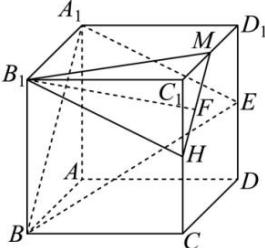

> [!faq]- 全练一本通解析
> **【答案】** A
>
> **【解析】**
> 解析:取 $CC_{1}$ 的中点 H, $C_{1}D_{1}$ 的中点 M, 连接 $B_{1}H, HM, MB_{1}$ ,
> 在正方体中, 明显有 $HM \parallel BA_{1}, B_{1}H \parallel A_{1}E$ ,
> 又 HM ∉ 面 $A_{1}BE$ , $BA_{1} \subset$ 面 $A_{1}BE$ , $B_{1}H \not\subset$ 面 $A_{1}BE$ , $A_{1}E \subset$ 面 $A_{1}BE$ ,
> 所以 HM // 面 $A_{1}BE$ , $B_{1}H$ // 面 $A_{1}BE$ ,
> 又 $HM, B_{1}H \subset$ 面 $B_{1}HM$ , $HM \cap B_{1}H = H$ ,
> 所以面 $B_{1}HM$ // 面 $A_{1}BE$ ,
> 当 F 在线段 MH 上运动时，有 $B_{1}F \parallel$ 平面 $A_{1}BE$ ,
> 即点 F 在侧面 $CDD_{1}C_{1}$ 上的轨迹为线段 MH，
> 又 $MH = \sqrt{2}C_{1}M = 2\sqrt{2}$ 故点 F 在侧面 $CDD_{1}C_{1}$ 上的轨迹长度为 $2\sqrt{2}$ . 故选：A.
> 
