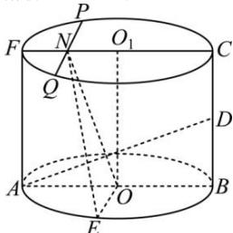

> [!faq]- 全练一本通解析
> **【答案】** C
>
> **【解析】**
> 解析: 连接 OE, 作 $ON \perp AD$ , 交 CF 于点 N,
> 
> ∵E是 $\widehat{AB}$ 的中点,∴ $OE\perp AB$ ,
> ∵ BC ⊥ 平面 ABE，OE ⊂ 平面 ABE，∴ BC ⊥ OE
> $$
> \because A B \cap B C = B, A B, B C \subset
> $$
> $$
> A B C F
> $$
> $$
> \therefore O E \perp
> $$
> $$
> A B C F
> $$
> $$
> A D \subset
> $$
> $$
> A B C F
> $$
> $$
> O E \cap O N = O
> $$
> $$
> O N E
> $$
> $$
> \therefore A D \perp
> $$
> 设平面 $ONE$ 与上底面交于 $PQ$ ， $\because ME\perp AD$ ，∴点 $M$ 的轨迹为 $PQ$ ； $\because AB = 4, BC = 3, D$ 是母线 $BC$ 中点， $\therefore \tan \angle BAD = \tan \angle O_1ON = \frac{BD}{AB} = \frac{3}{8}$ $\therefore O_1N = OO_1\cdot \tan \angle O_1ON = \frac{9}{8}$ $\therefore PQ = 2\sqrt{2^2 - \left(\frac{9}{8}\right)^2} = \frac{5\sqrt{7}}{4}$ .
>
> 故选 **C**.
