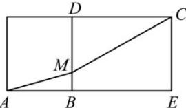

> [!faq]- 全练一本通解析
> **【答案】** $\sqrt{26}$
>
> **【解析】**
> 将二面角 $\alpha - l - \beta$ 平摊开来, 即为如下图形,
> 
> 当 $A, M, C$ 在一条直线上时 $AM + CM$ 有最小值，最小值为对角线 $AC$ ，因为 $AE = 2 + 3 = 5, CE = BD = 1$ ，所以 $AC = \sqrt{AE^2 + CE^2} = \sqrt{26}$ 故答案为： $\sqrt{26}$ 。
