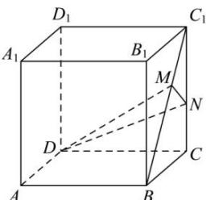
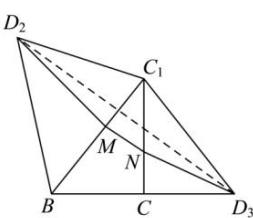

> [!faq]- 全练一本通解析
> **【答案】** B
>
> **【解析】**
> B解析：点 $M$ 在线段 $BC_{1}$ 上运动，即动线段 $DM$ 在 $\triangle BC_1D$ 内运动，动线段 $DN$ 在 $\triangle DCC_1$ 内运动，动线段 $MN$ 在 $\triangle BCC_1$ 内运动，以 $\triangle BCC_1$ 为基准，将 $\triangle BC_1D$ 和 $\triangle DCC_1$ 翻折使其与 $\triangle BCC_1$ 共面，如图所示：
> 
> 
> 其中 $\triangle BC_{1}D$ 翻折至 $\triangle BC_{1}D_{2}$ ， $\triangle DCC_{1}$ 翻折至 $\triangle CC_{1}D_{3}$ ， $\triangle DMN$ 的周长等于 $D_{2}M + MN + ND_{3}$ ，最小值等于 $D_{2}D_{3}$ 在四边形 $C_1D_2 = C_1D_3 = \sqrt{2}$ ， $\angle D_2C_1D_3 = 150^\circ$ ，由余弦定理可求得 $D_{2}D_{3}^{2} = 2 + 2 - 2\times \sqrt{2}\times \sqrt{2}\times \left(-\frac{\sqrt{3}}{2}\right) = 4 + 2\sqrt{3}$ 所以 $D_{2}D_{3} = 1 + \sqrt{3}$ 故 $\triangle DMN$ 的周长最小值等于 $1 + \sqrt{3}$ ，
>
> 故选 **B**.
