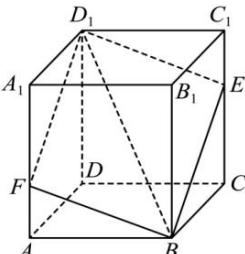

<!-- question-source:start -->
【26】如图所示, 在长方体 $ABCD-A_{1}B_{1}C_{1}D_{1}$ 中, $BB_{1}=B_{1}D_{1}$ , 点 E 是棱 $CC_{1}$ 上的一个动点, 平面 $BED_{1}$ 交棱 $AA_{1}$ 于点 F, 下列命题错误的是（）

A. 四棱锥 $B_{1} - BED_{1}F$ 的体积恒为定值
B. 存在点 $E$ ，使得 $B_{1}D \perp$ 平面 $BD_{1}E$ C. 存在唯一的点 $E$ ，使得截面四边形 $BED_{1}F$ 的周长取得最小值
D. 对于棱 $CC_{1}$ 上任意一点 $E$ ，在棱 $AD$ 上均有相应的点 $G$ ，使得 $CG //$ 平面 $EBD_{1}$
<!-- question-source:end -->

![[Q00006154A1]]
