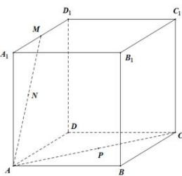

<!-- question-source:start -->
【30】（多选）如图, 正方体 $ABCD-A_{1}B_{1}C_{1}D_{1}$ 的棱长为 2, M 为棱 $A_{1}D_{1}$ 的中点, N 为线段 AM 的中点, 点 P 是线段 AC 上不与端点 A 重合的动点, 则（）

A. $A, M, C_{1}, C$ 四点共面
B. 三棱锥 $P - DA_{1}C_{1}$ 的体积为定值
C. 平面 $ANP \perp$ 平面 $BB_{1}D_{1}D$ D. 过 $A, N, P$ 三点的平面截该正方体所得截面的面积为定值
<!-- question-source:end -->

![[Q00006158A1]]
