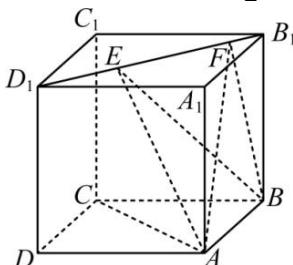

<!-- question-source:start -->
【34】（2023·重庆高二上期末）如图, 已知正方体 $ABCD - A_{1}B_{1}C_{1}D_{1}$ 的棱长为 1, 线段 $B_{1}D_{1}$ 上有两个动点 E, F, 且 $EF = \frac{\sqrt{2}}{2}$ , 则下列结论中错误的是()

A. $AC \perp BE$ B. $EF / /$ 平面ABCD
C. 直线 $AB$ 与平面BEF所成的角为定值
D. 异面直线 $AE, BF$ 所成的角为定值
<!-- question-source:end -->

![[Q00006162A1]]
